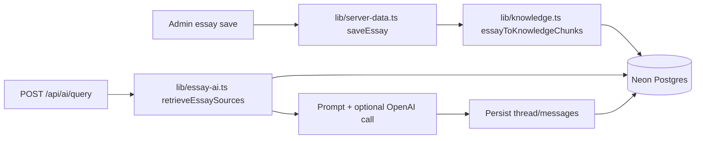

# AI Knowledge Layer

The essay archive now runs from Neon Postgres and includes a live retrieval layer
for the **Talk to Mr. Poppin** chat experience. Embedding/vector columns exist in
the schema, but runtime retrieval is currently lexical keyword scoring.

## What the layer is for

- Store each essay as the canonical Postgres record
- Split essays into searchable chunks for retrieval
- Keep discussion threads and messages tied to the essay knowledge base
- Return cited source excerpts to the chat UI
- Keep schema room for future embeddings and training examples

## Runtime flow



## Tables and current status

| Table or view | Status | Purpose |
|---------------|--------|---------|
| `essays` | Live | Canonical essay records used by public pages and admin |
| `essay_chunks` | Live | Searchable title/heading/paragraph chunks for retrieval |
| `site_pages` | Live | About/author/static page content |
| `featured_essays` | Live | Homepage curation order; separate from `essays.featured` |
| `ai_discussion_threads` | Live | Chat thread headers |
| `ai_discussion_messages` | Live | Stored user and assistant messages with source metadata |
| `essay_knowledge_documents` | Live view | Read model over essay chunks |
| `ai_training_examples` | Schema only | Reserved for future evaluation/tuning capture |

## Data ownership

- `lib/db.ts` requires `DATABASE_URL` at module load and connects with
  `ssl: "require"`.
- Public essay pages, admin APIs, featured essays, and chat all read from
  Postgres through `lib/server-data.ts` / `lib/essay-ai.ts`.
- `lib/data.ts` contains seed defaults. `npm run db:seed` truncates and reloads
  essays, chunks, pages, and featured positions from those defaults.
- `public/essays/*.json` files are legacy static-export artifacts; application
  code does not use them.

## Chunking and retrieval

- Chunking happens in `lib/knowledge.ts`. Essays are split into title, heading,
  and paragraph chunks.
- `scripts/seed-neon.mjs` creates chunks during seed.
- `saveEssay()` deletes and re-inserts chunks every time an essay is saved in
  admin, keeping retrieval aligned with edits.
- `retrieveEssaySources()` ranks chunks by normalized token overlap, with higher
  weight for title and slug matches. It returns the top sources, or fallback
  chunks if nothing scores.
- The `essay_chunks.embedding` column and `pgvector` extension are present, but
  no current code writes embeddings or performs vector search.

## Chat API contract

`POST /api/ai/query`

Request:

```json
{
  "question": "What does Mr. Poppin say about discipline?",
  "threadId": "optional-existing-thread",
  "essaySlug": "optional-filter"
}
```

Response:

```json
{
  "threadId": "persisted-thread-id",
  "answer": "assistant response",
  "configured": true,
  "model": "gpt-4o-mini",
  "sources": [
    {
      "essayId": 1,
      "essaySlug": "essay-slug",
      "essayTitle": "Essay title",
      "essayCategory": "Category",
      "chunkId": 10,
      "chunkOrder": 2,
      "kind": "paragraph",
      "heading": "Optional heading",
      "score": 7,
      "excerpt": "First 240 characters of the source chunk"
    }
  ]
}
```

`OPENAI_API_KEY` is optional. Without it, the API still returns a persisted
thread, source excerpts, and a fallback answer grounded directly in retrieved
passages; `configured` is `false` and `model` is `null`.

## Operational constraints

- `DATABASE_URL` is required for server routes and builds that import database
  code.
- `OPENAI_MODEL` defaults to `gpt-4o-mini` when OpenAI is configured.
- The admin password gate is client-side, and the current `/api/*` routes do not
  enforce server-side authentication. Treat admin/API exposure accordingly.
- The homepage featured list comes from `featured_essays` and requires exactly
  four selected IDs in the admin Featured tab. The `essays.featured` boolean is
  a separate per-essay flag and does not update homepage curation by itself.

